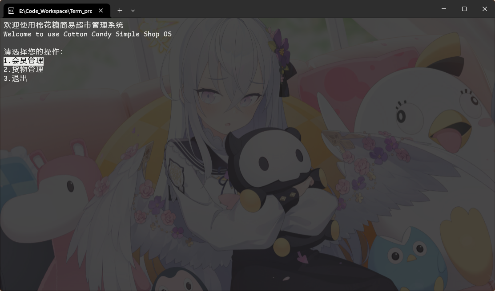
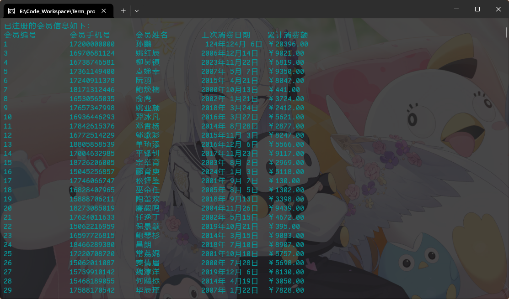

# 棉花糖简易超市管理操作系统
### Cotton Candy Simple Shop Management Operating System

这是一个基于C语言的简易Windows平台Dos超市管理系统，立项契机为C语言程序设计的课程设计。

The project is a simple Windows platform Dos supermarket management system based on C language. The project is initiated by the course design of C language program design.

## 运行注意事项
#### Attention
程序会在运行目录下生成key.dat、vip.dat、stock.dat，如果运行目录下已有这些文件，则不会重新生成。这些文件是程序运行时需要用到的数据文件，请勿删除。建议在文件夹中运行。

The program will generate key.dat, vip.dat, stock.dat in the running directory. If there are already these files in the running directory, they will not be regenerated. These files are the data files needed during the program run, please do not delete them. It is recommended to run in the folder.

本产品只能在Windows下运行。

This product can only be run on Windows.

## 程序运行截图
#### Screenshots

> 本产品技术含量较低，仅供学习交流使用，请勿用于商业用途。

> This product has a low level of technical content. It is only for learning and communication. Do not use it for commercial purposes.